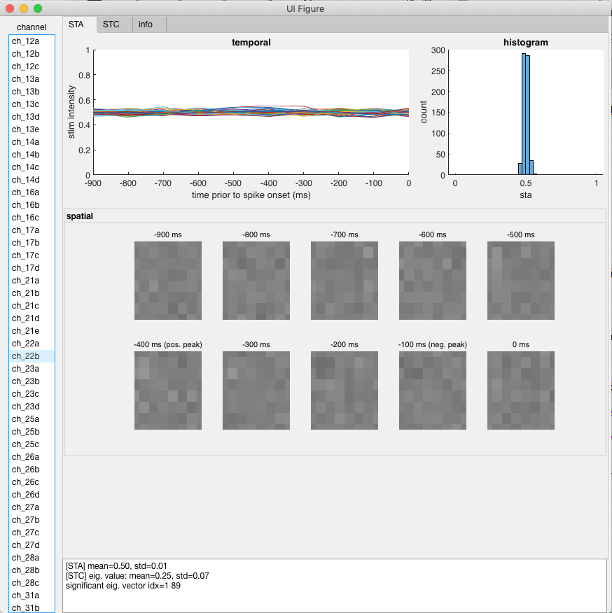
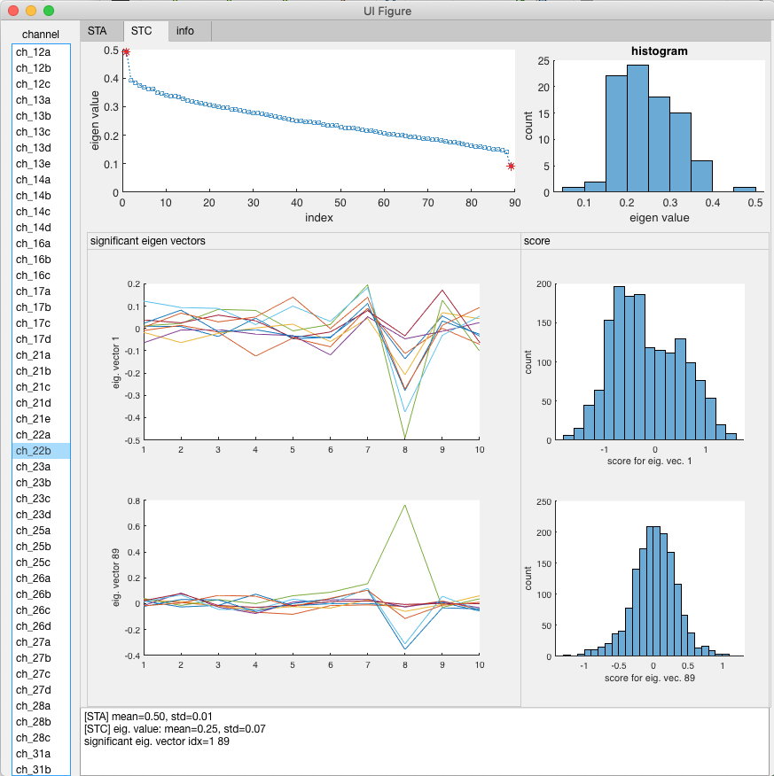

# Retina Project (collaboration with CBNU College of Medicine)

## Core functions
* [`load_data.m`](load_data.m) - load random stimulus and spike time info from mat files (and save them to txt files)
* [`calc_STA_and_STC.m`](calc_STA_and_STC.m) - calculate STA and STC
* [`find_significant_eigen_values.m`](find_significant_eigen_values.m) - find significant eigen values of STC using a nested hypothesis test

## How to run STA and STC
* See [`demo_sta_vs_stc.m`](demo_sta_vs_stc.m)

## Matlab App (GUI) added for easier analysis!
* All the STA and STC results must be in the current workspace. 

  For example, right after running `demo_sta_vs_stc`, save results to a MAT file (about 100~200 MB).
  ```
  save results_20190922.mat
  ```

  And, load the file when you want to analyze the results.
  ```
  clear
  load results_20190922.mat
  ```

  
* add `tools` to path 
  ```
  addpath tools
  ```

* launch the app by typing 
  ```
  stc_app
  ```

* In the chennel list on the left, cleck the channel you want to anlyze.

* Click 'STA' or 'STC' tap on the top





## [FUTURE WORK] To add GLM analysis
1. Install [GLMspiketools](https://github.com/ys7yoo/GLMspiketools) developed by [J. Pillow](https://github.com/pillowlab/GLMspiketools).
2. Run `estimGLM.m` to calc STA, GLM, and bilinear GLM for some chosen channels.
